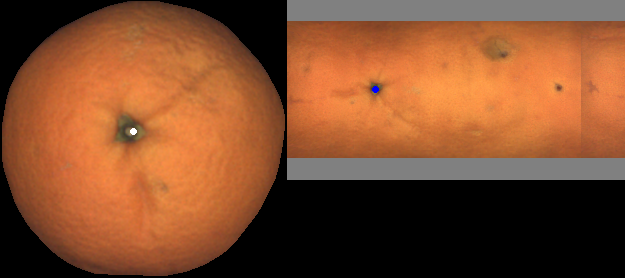

# FFTMap

This repository contains the dataset used in the paper _"Fast Fruit Topographic Map Creation From Estimated Rotations"_, currently under review

Each fruit folder contains the images of the dataset for the corresponding fruit: mandarins, oranges and tomatoes, as well as the ground truth data to obtain the paper results.
This ground truth data consists basically in the location of points in the original view and its position on the generated map, as shown in this example:

The folder `viewer`contains a Python script that automatizes the process of visualising the complete ground truth data.

If you use this repository, please cite our paper: