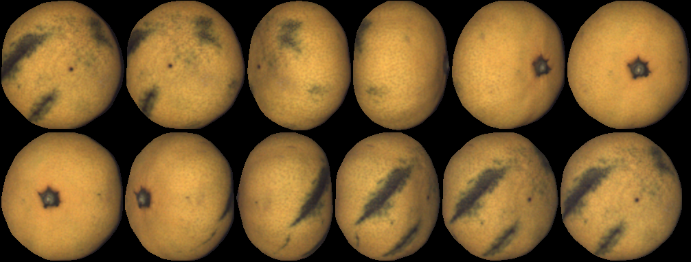
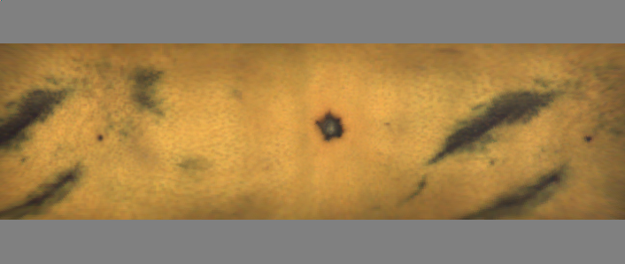

# FSMap: Fruit Surface Mapping  

This repository contains views and maps of the dataset used in the paper _"Single Fusion Image from Collections of Fruit Views for Defect
Detection and Classification"_.

Check also [this link](https://github.com/csdemeras/FSMap_complement)  for more examples.

If you use this repository, please cite our paper:

Albiol A, Sánchez de Merás C, Albiol A, Hinojosa S. _Single Fusion Image from Collections of Fruit Views for Defect Detection and Classification_. Sensors. 2022; 22(14):5452. https://doi.org/10.3390/s22145452
